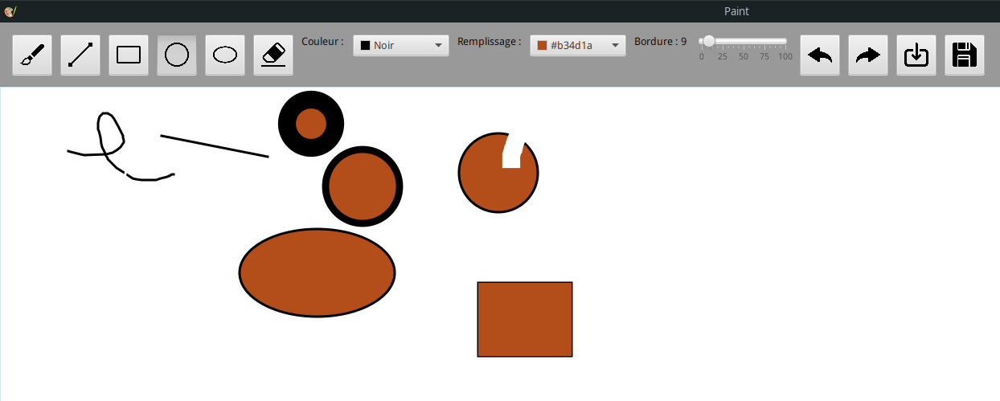

# Paint-JavaFx

Il s'agit d'une application en JAVA-FX visant a reproduire des fonctionnalités de paint, car celui-ci n'est pas présent sur linux.

## Réalisation :

Dans ce repository vous retrouverez le code de l'application. 

## Contributeur :
- https://github.com/Duffscs
